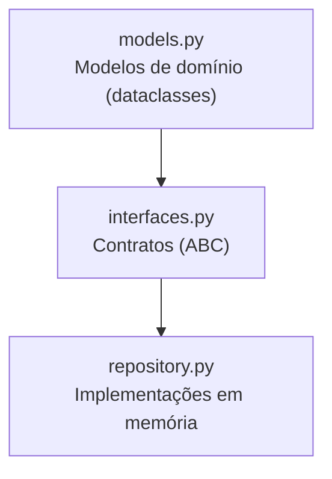
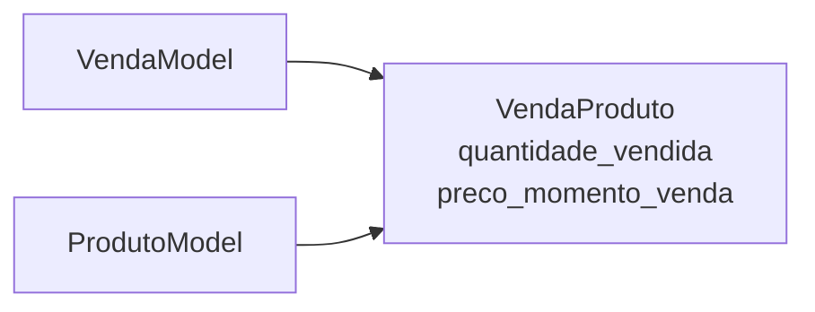

# Explicação do Código — Sistema de Vendas (TRABALHO-2)

Documentação da arquitetura e do funcionamento do código deste trabalho.
O projeto segue uma separação em **camadas**, aplicando o **padrão Repository**
(uma variação do padrão DAO) com **interfaces (contratos)** e
**implementações em memória**.

---

## 1. Visão geral da arquitetura



A ideia central é a **inversão de dependência**:

- Os **modelos** representam os dados do domínio.
- As **interfaces** definem *o que* cada repositório deve fazer (o contrato), sem dizer *como*.
- Os **repositórios** dizem *como* fazer, guardando os dados em memória.

Assim, o restante do sistema pode depender apenas das **interfaces**, sem
conhecer o armazenamento real (memória, SQLite, PostgreSQL, etc.).

---

## 2. Estrutura de arquivos

| Arquivo | Responsabilidade |
|---|---|
| `models.py` | Entidades/dados do domínio (dataclasses e um `Enum`). |
| `interfaces.py` | Contratos abstratos (`ABC`) de persistência para cada modelo. |
| `repository.py` | Implementações concretas dos contratos, guardando os dados em memória. |

---

## 3. `models.py` — Modelos de domínio

Usa `@dataclass`, que gera automaticamente `__init__`, `__repr__` e `__eq__`
a partir dos campos anotados — evitando código repetitivo.

| Classe | Campos | Descrição |
|---|---|---|
| `CategoriaModel` | `id`, `tipo_categoria`, `descricao`, `margem_lucro` | Categoria de produtos. |
| `VendaModel` | `id`, `datahora_venda`, `desconto` | Uma venda realizada. |
| `TipoPagamento` (Enum) | `PIX`, `CREDITO`, `DEBITO`, `ESPECIE` | Formas de pagamento possíveis. |
| `FormaPagamentoModel` | `id`, `tipo_pagamento`, `valor_pago`, `venda` | Pagamento associado a uma venda. |
| `ProdutoModel` | `id`, `nome`, `descricao`, `preco`, `quantidade_estoque`, `alerta_estoque_baixo`, `codigo_interno`, `margem_lucro`, `categoria` | Produto do catálogo. |
| `VendaProduto` | `quantidade_vendida`, `preco_momento_venda`, `venda`, `produto` | Item de uma venda (liga venda ↔ produto). |

**Relacionamentos:**

- `ProdutoModel.categoria` → aponta para um `CategoriaModel`.
- `FormaPagamentoModel.venda` → aponta para um `VendaModel`.
- `VendaProduto.venda` → aponta para o `VendaModel` e
  `VendaProduto.produto` → aponta para o `ProdutoModel`.

> **Observação sobre `id`:** `CategoriaModel`, `VendaModel`,
> `ProdutoModel` e `FormaPagamentoModel` possuem campo `id`, usado como
> chave primária. Já `VendaProduto` **não** tem `id`, pois é um item de
> venda identificado pela **chave composta** (`venda`, `produto`).

---

## 4. `interfaces.py` — Contratos de persistência

Cada interface é uma **classe abstrata** (`ABC`) com métodos marcados como
`@abstractmethod`. Isso significa que:

- Elas **não podem ser instanciadas** diretamente.
- Qualquer repositório concreto é **obrigado** a implementar todos os métodos.

| Interface | Modelo alvo |
|---|---|
| `CategoriaDAOInterface` | `CategoriaModel` |
| `ProdutoDAOInterface` | `ProdutoModel` |
| `VendaDAOInterface` | `VendaModel` |
| `FormaPagamentoDAOInterface` | `FormaPagamentoModel` |
| `VendaProdutoDAOInterface` | `VendaProduto` |

As quatro primeiras expõem o mesmo CRUD:

| Método | Retorno | O que faz |
|---|---|---|
| `inserir(entidade)` | `int` | Grava e retorna o id gerado. |
| `buscar_por_id(id)` | modelo ou `None` | Busca por chave primária. |
| `listar()` | `list` de modelos | Retorna todos os registros. |
| `atualizar(entidade)` | `None` | Atualiza um registro existente. |
| `remover(id)` | `None` | Remove pelo id. |

A `VendaProdutoDAOInterface` é diferente, por causa da **chave composta**:

| Método | O que faz |
|---|---|
| `inserir(item)` | Grava um item de venda. |
| `listar()` | Lista todos os itens. |
| `listar_por_venda(id_venda)` | Lista os itens de uma venda. |
| `buscar_por_venda_e_produto(id_venda, id_produto)` | Busca um item. |
| `atualizar(item)` | Atualiza um item. |
| `remover(id_venda, id_produto)` | Remove um item. |

---

## 5. `repository.py` — Implementações em memória

Cada classe herda da interface correspondente e guarda os dados em um
**dicionário** (`dict`), gerando ids automaticamente a partir de 1.

```python
class CategoriaRepository(CategoriaDAOInterface):
    def __init__(self) -> None:
        self._categorias: dict[int, CategoriaModel] = {}
        self._proximo_id = 1
    ...
```

| Classe | Interface implementada | Armazenamento |
|---|---|---|
| `CategoriaRepository` | `CategoriaDAOInterface` | `dict[int, CategoriaModel]` |
| `ProdutoRepository` | `ProdutoDAOInterface` | `dict[int, ProdutoModel]` |
| `VendaRepository` | `VendaDAOInterface` | `dict[int, VendaModel]` |
| `FormaPagamentoRepository` | `FormaPagamentoDAOInterface` | `dict[int, FormaPagamentoModel]` |
| `VendaProdutoRepository` | `VendaProdutoDAOInterface` | `dict[(int, int), VendaProduto]` |

**Comportamentos gerais:**

- `inserir` atribui o próximo id ao objeto (`entidade.id = self._proximo_id`)
  e depois o guarda no dicionário.
- `buscar_por_id` usa `dict.get`, retornando `None` quando não encontra.
- `listar` devolve uma **cópia** da lista de valores
  (`list(self._dados.values())`), evitando que o chamador altere a
  coleção interna.
- `atualizar` lança `KeyError` se o id **não** existir.
- `remover` usa `pop(id, None)`, ou seja, **não** reclama se o id não existir.

**Caso especial — `VendaProdutoRepository`:**

```python
@staticmethod
def _chave(item: VendaProduto) -> tuple[int, int]:
    return (item.venda.id, item.produto.id)
```

Isso implementa a chave composta `(id_venda, id_produto)`.

---

## 6. Caso especial: `VendaProduto` (item de venda)

`VendaProduto` **não é uma entidade "dona" de dados**; é uma entidade de
**associação**. Ele representa **uma linha de uma venda**: "na venda X,
foram vendidas N unidades do produto Y, ao preço unitário Z".

```python
@dataclass
class VendaProduto:
    quantidade_vendida: int
    preco_momento_venda: float
    venda: VendaModel
    produto: ProdutoModel
```

### Por que ele existe?

`Venda` e `Produto` têm um relacionamento **N:N** (uma venda tem vários
produtos; um produto aparece em várias vendas). Nesse tipo de relação
normalmente se cria uma **entidade intermediária** — e aqui ela é
necessária porque a relação carrega **atributos próprios**:

| Campo | Papel |
|---|---|
| `quantidade_vendida` | Quantas unidades daquele produto foram vendidas **nesta** venda. |
| `preco_momento_venda` | Preço **congelado** no instante da venda (snapshot). |
| `venda` | Referência à venda (`VendaModel`). |
| `produto` | Referência ao produto (`ProdutoModel`). |

O `preco_momento_venda` é o ponto sutil: se o preço do produto mudar
depois, o histórico da venda **não** pode mudar. Por isso se guarda o
preço praticado na hora, em vez de ler sempre `produto.preco`.



### Por que **não** tem `id`?

Porque ele é identificado pela **chave composta** (`venda`, `produto`).
Neste modelo, um mesmo produto aparece **no máximo uma vez** por venda —
então o par já identifica a linha unicamente. No `repository.py`:

```python
@staticmethod
def _chave(item: VendaProduto) -> tuple[int, int]:
    return (item.venda.id, item.produto.id)
```

E o repositório guarda em `dict[(int, int), VendaProduto]`, com métodos
próprios em vez do CRUD padrão:

| Método | O que faz |
|---|---|
| `inserir(item)` | Grava o item (chave = `(venda.id, produto.id)`). |
| `listar()` | Todos os itens. |
| `listar_por_venda(id_venda)` | Todos os itens de uma venda. |
| `buscar_por_venda_e_produto(id_venda, id_produto)` | Um item específico. |
| `atualizar(item)` | Atualiza um item existente. |
| `remover(id_venda, id_produto)` | Remove um item. |

### Exemplo

```python
venda_id = vendas.inserir(VendaModel(0, "2026-10-05 14:30", 0.0))
produto_id = produtos.inserir(ProdutoModel(0, "Refrigerante", "Lata 350ml",
                                           5.0, 100, 10, 123, 0.5, categoria))

itens = VendaProdutoRepository()
itens.inserir(VendaProduto(
    quantidade_vendida=3,
    preco_momento_venda=5.0,
    venda=vendas.buscar_por_id(venda_id),
    produto=produtos.buscar_por_id(produto_id),
))

itens.listar_por_venda(venda_id)  # [VendaProduto(quantidade_vendida=3, ...)]
```

> **Cuidado:** a chave depende de `venda.id` e `produto.id`. Então a venda
> e o produto precisam ser **inseridos primeiro** (para receberem id). Se
> você criar um `VendaProduto` com objetos que ainda têm `id = 0`, a chave
> vira `(0, 0)` e todos os itens colidem no mesmo lugar do dicionário.

---

## 7. Exemplo de uso

```python
from models import CategoriaModel, ProdutoModel
from repository import CategoriaRepository, ProdutoRepository

categorias = CategoriaRepository()
produtos = ProdutoRepository()

cat_id = categorias.inserir(
    CategoriaModel(0, "Bebidas", "Bebidas em geral", 0.30)
)

produtos.inserir(ProdutoModel(
    id=0,
    nome="Refrigerante",
    descricao="Lata 350ml",
    preco=5.0,
    quantidade_estoque=100,
    alerta_estoque_baixo=10,
    codigo_interno=123,
    margem_lucro=0.5,
    categoria=categorias.buscar_por_id(cat_id),
))

for produto in produtos.listar():
    print(produto.nome, produto.categoria.tipo_categoria)
```

---

## 8. Teste de contrato

Como as classes herdam das `ABC` de `interfaces.py`, se faltar a
implementação de **qualquer** método abstrato o Python levanta um
`TypeError` ao tentar instanciar a classe:

```
TypeError: Can't instantiate abstract class CategoriaRepository
with abstract method remover
```

Isso garante que todo repositório cumpra o contrato definido na interface.

---

## 9. Decisões de projeto

- **Padrão Repository/DAO:** separa a lógica de domínio da lógica de
  persistência, facilitando trocar a tecnologia de armazenamento.
- **Interfaces explícitas:** uma interface por modelo, tornando o contrato
  claro e permitindo múltiplas implementações (memória, banco real, etc.).
- **`id` nos modelos:** adicionado em `ProdutoModel` e
  `FormaPagamentoModel` para viabilizar a busca/remoção por chave primária
  exigida pelas interfaces.
- **`VendaProduto` com chave composta:** por não representar uma entidade
  independente, mas um item de venda.
- **Tipagem moderna:** uso de `from __future__ import annotations` e
  anotações como `list[T]` e `T | None`.

---

## 10. Próximos passos sugeridos

1. Implementar um repositório real (ex.: `sqlite_repository.py` com `sqlite3`),
   implementando as mesmas interfaces.
2. Criar uma **camada de serviço** (ex.: `VendaService`) que use as interfaces,
   sem saber qual implementação está ativa.
3. Adicionar **testes** (`test_repository.py`) validando o CRUD.
